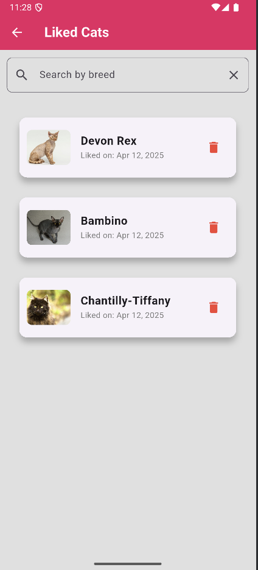

# Cat Tinder App

## Описание приложения
Cat Tinder - это приложение, которое позволяет вам просматривать случайные фотографии котиков и их породы. Вы можете свайпать вправо, чтобы лайкнуть котика, или влево, чтобы пропустить. Приложение также ведет счетчик ваших лайков и позволяет просматривать список понравившихся котиков. Если вам понравился какой-то котик особенно, вы можете нажать на его изображение, чтобы узнать больше о его породе на отдельном экране с подробным описанием.

## Реализованные фичи
- Отображение случайного изображения котика и названия его породы на главном экране.
- Возможность свайпать изображение котика влево (дизлайк) или вправо (лайк).
- Две кнопки "лайк" и "дизлайк" для взаимодействия с котиками.
- Смена котика на нового при свайпе или нажатии на кнопку.
- Увеличение счетчика лайков при каждом лайке котика.
- Переход на экран детального описания при нажатии на изображение котика.
- На экране детального описания отображается изображение котика и полная информация о его породе (название, происхождение, темперамент, описание).
- Отдельный экран со списком всех понравившихся котиков, доступный по нажатию на иконку сердечка в верхней панели.
- Возможность просмотра деталей понравившегося котика из списка.

## Скриншоты интерфейса
### Домашний экран

### Детальный экран

### Понравившиеся котики

## Скачать приложение
[Скачать APK](https://github.com/andreylikhterman/Flutter_hw1/releases/tag/v1.0.0)

## Технологии
- Flutter
- Dart

## Запуск приложения
1. Убедитесь, что на вашем компьютере установлен Flutter SDK.
2. Клонируйте этот репозиторий.
3. Перейдите в каталог проекта в терминале.
4. Выполните команду `flutter pub get` для установки зависимостей.
5. Запустите приложение на эмуляторе или реальном устройстве с помощью команды `flutter run`.
